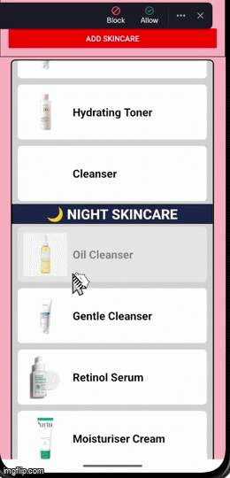

# 💆‍♀️ Hello, this is my app!

**This app guides beginners through a simple day and night skincare routine, explaining each basic step.**

---

## 🧴 What is this app about?

This app is a simple **skincare routine helper** that displays a list of products split into two main parts of the day:

- 🌞 **Morning Skincare**
- 🌙 **Night Skincare**

Each section shows different skincare steps (such as cleanser, toner, sunscreen, and moisturiser) together with a product image loaded from the web.  
The app is built using **`SectionList`**, **`StyleSheet`**, and **Flexbox** to organise the layout neatly on screen.

When the user taps on any skincare item, a short toast message appears to confirm that the step has been selected.

---

## ✨ Notable Features

- **Two sections using SectionList**
    - 🌞 Morning Skincare
    - 🌙 Night Skincare

- **Images for every list item**  
  Each skincare step includes a product image loaded via a remote image URL.

- **Styled Section Headers**  
  Custom background and font colours for each section to match the morning/night theme.

- **Tap Feedback with ToastAndroid**  
  Tapping on a list item shows a toast message: `"Skincare Selected!"`

- **Flexbox Layout and StyleSheet**  
  Uses Flexbox to place text and image in a row layout.  
  Styles are separated using `StyleSheet.create` for clean and readable code.

---

## 🖼 Screenshots of the App

---

## 📦 Download the App

Feel free to download and try it on your Android device:  
👉 [**Download APK**](./docs/app-release.apk)

---

### 🧑‍💻 Developer
**Name:** Lionel Sem Wei Jun  
**Course:** Diploma in Digital Design & Development, Republic Polytechnic  
**Module:** C390 Portfolio Development

---

⭐ *“A clean skin is a confident start — even in coding!”*  
